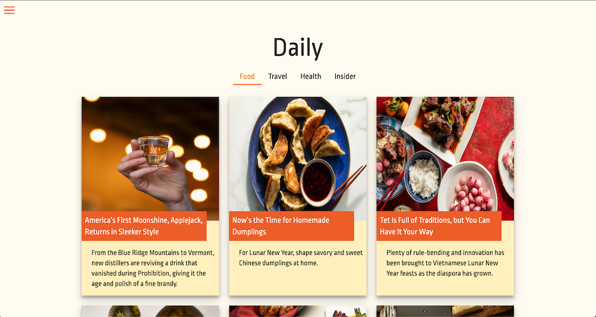

## Daily

 

### Description

---

Daily is a news website gathering daily information from New York Times API and mainly based on Food, Travel, Health, Insider Topics.
 

### Main Features

---

-   Retrieve the Top Stories from New York Times API.
-   Editable article topics. [(available topics)](https://developer.nytimes.com/docs/top-stories-product/1/overview)
-   Add loading spinner while connecting to api.
-   Reusable form template.
-   Reusable tabs component.
     

### Credits

---

-   Google Fonts
-   New York Times API
-   Create React App
-   react-icons
-   react-tabs
-   react-spinners
-   react-hook-form
-   react-router-dom
     

### Workflow

---

-   [Interface Design](https://www.figma.com/file/9Ep7FByD9y8UoMQdEFybUS/DailyFood?node-id=0%3A1)
-   [Workflow Diagram](https://documentcloud.adobe.com/link/review?uri=urn:aaid:scds:US:2c10cf4e-b59c-493e-8f41-83032cf8a1d4)
